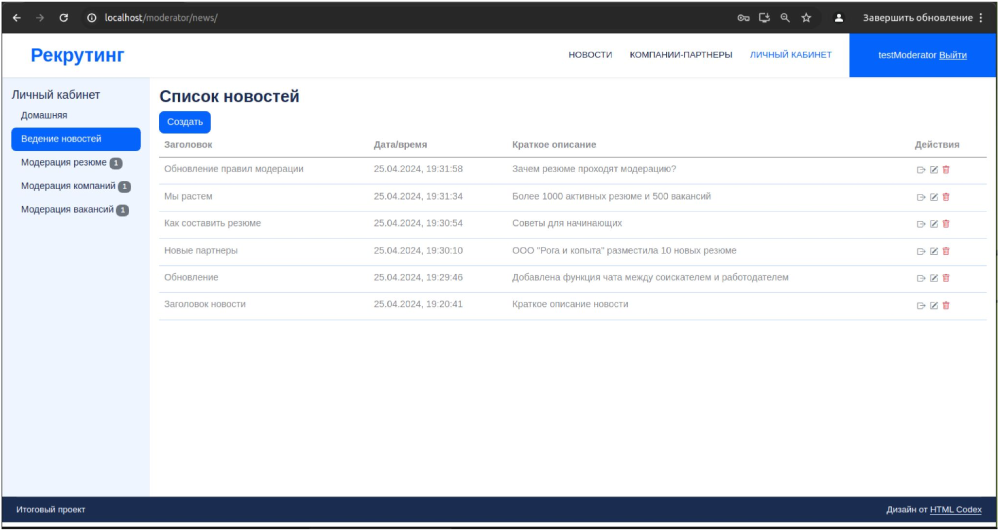

# GB_recruting
Рекрутинг (итоговый проект)
## Описание проекта

Рекрутинговый интернет-портал по аналогии с hh.ru, который позволит связать между собой сотрудников, ищущих работу и работодателей, которые ищут подходящих сотрудников по средствам размещения и подбора вакансий и резюме.
 - Готовый сайт, где могут регистрироваться соискатели и работодатели через указание электронной почты.
- Реализована возможность размещения информации о работодателях и вакансиях работодателями (с модерацией) и откликов на них со стороны соискателей
- Реализована возможность размещения резюме соискателями (с модерацией) и отправкой предложений о работе со стороны работодателей.

   
Подробное описание в [презентации](docs/%D0%A0%D0%B5%D0%BA%D1%80%D1%83%D1%82%D0%B8%D0%BD%D0%B3.pdf)

## Архитектура и технологии
| Блок | Технологии / языки / фреймворки   |
|--|--|
|Фронтенд, приложение |React, axios, i8n  Bootstrap CSS |
|Фронтенд, веб-сервер |nginx |
|Бэкенд, приложение |Django 4.1, DRF |
|Бэкенд, БД |Postgres (или любая совместивая с Django СУБД)|
|Бэкенд, веб-сервер |nginx + unicorn  |

[Архитектура](docs/Components.drawio.png)

## Как попробовать

Для запуска в Linux-среде необходимо использовать Docker-compose.
**Настроена учебная конфигурация, не подходящая для промышленного использования!**

 1. Скопировать исходные файлы, перейти в корневой каталог  `git clone https://github.com/ivanstgit/GB_recruting.git`   `cd GB_recruting/`
 2. (опционально) Сгенерировать Django secret key:   `openssl rand -base64 40 >> secrets/django_secret_key.txt`   
 3. (опционально) Поменять пароли и настройки в каталоге `/secrets`
 4. (опционально) Если разворачивать на сервере, то подставить имя сервера в env-файле `frontend/.env/production` по маске `REACT_APP_API_URL=http://<your server hostname>:8000/api`
5. Запустить сборку   `sudo docker-compose up --build`
6. http://localhost или http://127.0.0.1:80

| Роль | Тестовый пользователь | Пароль   |
|--|--|--|
|Соискатель |testEmployee |password |
|Работодатель |testEmployer |password |
|Модератор |testModerator |password |

swagger-ui доступен по адресу http://127.0.0.1:8000/api/schema/v1.0/swagger-ui/ только для сотрудников (testModerator)
Тестовый почтовый сервер (на него отправляется код для подтверждения e-mail) http://localhost:1080/

Логи ошибочных запросов внутри контейнера backend:
`sudo docker ps`
`sudo docker exec -it <container_id> bash`
`cat django_error.log`